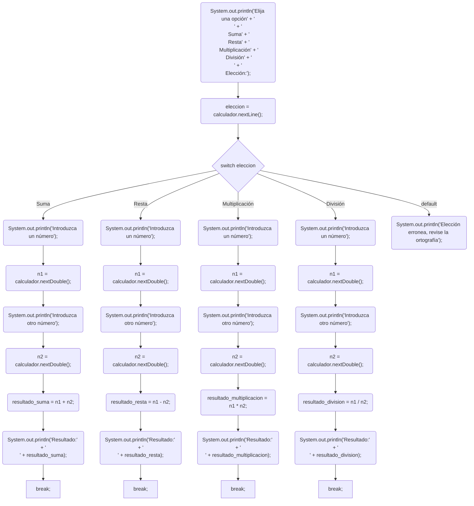

```mermaid
graph TD
  froml1c0tol1c132("System.out.println('Elija una opción' + '\n' + '\n Suma' + '\n Resta' + '\n Multiplicación' + '\n División' + '\n' + '\nElección:');")
  froml2c8tol2c41("eleccion = calculador.nextLine();")
  froml5c8tol45c9{"switch eleccion "}
  froml8c16tol8c59("System.out.println('Introduzca un número');")
  froml9c16tol9c45("n1 = calculador.nextDouble();")
  froml10c16tol10c61("System.out.println('Introduzca otro número');")
  froml11c16tol11c45("n2 = calculador.nextDouble();")
  froml12c16tol12c41("resultado_suma = n1 + n2;")
  froml13c16tol13c73("System.out.println('Resultado:' + '\n' + resultado_suma);")
  froml14c16tol14c22["break;"]
  froml17c16tol17c59("System.out.println('Introduzca un número');")
  froml18c16tol18c45("n1 = calculador.nextDouble();")
  froml19c16tol19c61("System.out.println('Introduzca otro número');")
  froml20c16tol20c45("n2 = calculador.nextDouble();")
  froml21c16tol21c42("resultado_resta = n1 - n2;")
  froml22c16tol22c74("System.out.println('Resultado:' + '\n' + resultado_resta);")
  froml23c16tol23c22["break;"]
  froml26c16tol26c59("System.out.println('Introduzca un número');")
  froml27c16tol27c45("n1 = calculador.nextDouble();")
  froml28c16tol28c61("System.out.println('Introduzca otro número');")
  froml29c16tol29c45("n2 = calculador.nextDouble();")
  froml30c16tol30c51("resultado_multiplicacion = n1 * n2;")
  froml31c16tol31c83("System.out.println('Resultado:' + '\n' + resultado_multiplicacion);")
  froml32c16tol32c22["break;"]
  froml35c16tol35c59("System.out.println('Introduzca un número');")
  froml36c16tol36c45("n1 = calculador.nextDouble();")
  froml37c16tol37c61("System.out.println('Introduzca otro número');")
  froml38c16tol38c45("n2 = calculador.nextDouble();")
  froml39c16tol39c45("resultado_division = n1 / n2;")
  froml40c16tol40c77("System.out.println('Resultado:' + '\n' + resultado_division);")
  froml41c16tol41c22["break;"]
  froml44c16tol44c77("System.out.println('Elección erronea, revise la ortografía');")
  froml1c0tol1c132 --> froml2c8tol2c41
  froml8c16tol8c59 --> froml9c16tol9c45
  froml9c16tol9c45 --> froml10c16tol10c61
  froml10c16tol10c61 --> froml11c16tol11c45
  froml11c16tol11c45 --> froml12c16tol12c41
  froml12c16tol12c41 --> froml13c16tol13c73
  froml13c16tol13c73 --> froml14c16tol14c22
  froml5c8tol45c9 -- "Suma" --> froml8c16tol8c59
  froml17c16tol17c59 --> froml18c16tol18c45
  froml18c16tol18c45 --> froml19c16tol19c61
  froml19c16tol19c61 --> froml20c16tol20c45
  froml20c16tol20c45 --> froml21c16tol21c42
  froml21c16tol21c42 --> froml22c16tol22c74
  froml22c16tol22c74 --> froml23c16tol23c22
  froml5c8tol45c9 -- "Resta" --> froml17c16tol17c59
  froml26c16tol26c59 --> froml27c16tol27c45
  froml27c16tol27c45 --> froml28c16tol28c61
  froml28c16tol28c61 --> froml29c16tol29c45
  froml29c16tol29c45 --> froml30c16tol30c51
  froml30c16tol30c51 --> froml31c16tol31c83
  froml31c16tol31c83 --> froml32c16tol32c22
  froml5c8tol45c9 -- "Multiplicación" --> froml26c16tol26c59
  froml35c16tol35c59 --> froml36c16tol36c45
  froml36c16tol36c45 --> froml37c16tol37c61
  froml37c16tol37c61 --> froml38c16tol38c45
  froml38c16tol38c45 --> froml39c16tol39c45
  froml39c16tol39c45 --> froml40c16tol40c77
  froml40c16tol40c77 --> froml41c16tol41c22
  froml5c8tol45c9 -- "División" --> froml35c16tol35c59
  froml5c8tol45c9 -- default --> froml44c16tol44c77
  froml2c8tol2c41 --> froml5c8tol45c9
```
