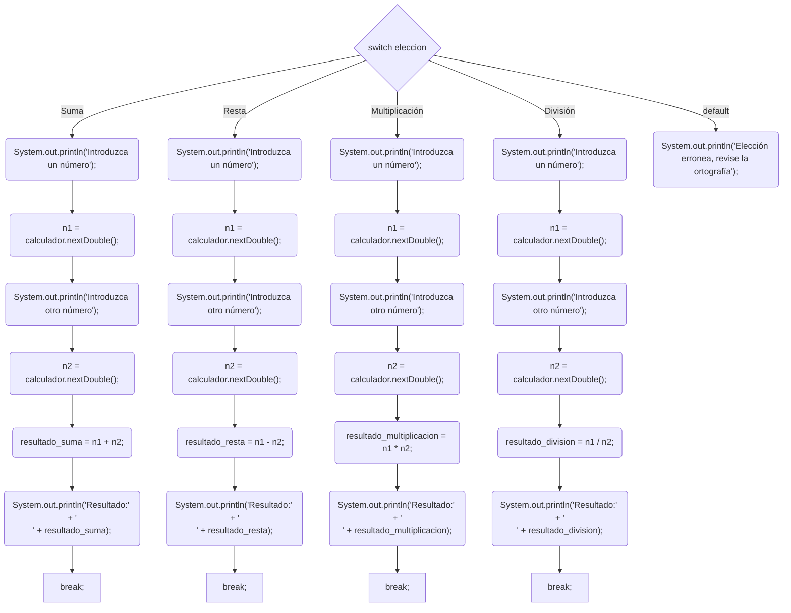

```mermaid
graph TD
  froml1c1tol43c2{"switch eleccion "}
  froml4c16tol4c59("System.out.println('Introduzca un número');")
  froml5c16tol5c45("n1 = calculador.nextDouble();")
  froml6c16tol6c61("System.out.println('Introduzca otro número');")
  froml7c16tol7c45("n2 = calculador.nextDouble();")
  froml8c16tol8c41("resultado_suma = n1 + n2;")
  froml9c16tol9c73("System.out.println('Resultado:' + '\n' + resultado_suma);")
  froml10c16tol10c22["break;"]
  froml13c16tol13c59("System.out.println('Introduzca un número');")
  froml14c16tol14c45("n1 = calculador.nextDouble();")
  froml15c16tol15c61("System.out.println('Introduzca otro número');")
  froml16c16tol16c45("n2 = calculador.nextDouble();")
  froml17c16tol17c42("resultado_resta = n1 - n2;")
  froml18c16tol18c74("System.out.println('Resultado:' + '\n' + resultado_resta);")
  froml19c16tol19c22["break;"]
  froml22c16tol22c59("System.out.println('Introduzca un número');")
  froml23c16tol23c45("n1 = calculador.nextDouble();")
  froml24c16tol24c61("System.out.println('Introduzca otro número');")
  froml25c16tol25c45("n2 = calculador.nextDouble();")
  froml26c16tol26c51("resultado_multiplicacion = n1 * n2;")
  froml27c16tol27c83("System.out.println('Resultado:' + '\n' + resultado_multiplicacion);")
  froml28c16tol28c22["break;"]
  froml31c16tol31c59("System.out.println('Introduzca un número');")
  froml32c16tol32c45("n1 = calculador.nextDouble();")
  froml33c16tol33c61("System.out.println('Introduzca otro número');")
  froml34c16tol34c45("n2 = calculador.nextDouble();")
  froml35c16tol35c45("resultado_division = n1 / n2;")
  froml36c16tol36c77("System.out.println('Resultado:' + '\n' + resultado_division);")
  froml37c16tol37c22["break;"]
  froml40c16tol40c77("System.out.println('Elección erronea, revise la ortografía');")
  froml4c16tol4c59 --> froml5c16tol5c45
  froml5c16tol5c45 --> froml6c16tol6c61
  froml6c16tol6c61 --> froml7c16tol7c45
  froml7c16tol7c45 --> froml8c16tol8c41
  froml8c16tol8c41 --> froml9c16tol9c73
  froml9c16tol9c73 --> froml10c16tol10c22
  froml1c1tol43c2 -- "Suma" --> froml4c16tol4c59
  froml13c16tol13c59 --> froml14c16tol14c45
  froml14c16tol14c45 --> froml15c16tol15c61
  froml15c16tol15c61 --> froml16c16tol16c45
  froml16c16tol16c45 --> froml17c16tol17c42
  froml17c16tol17c42 --> froml18c16tol18c74
  froml18c16tol18c74 --> froml19c16tol19c22
  froml1c1tol43c2 -- "Resta" --> froml13c16tol13c59
  froml22c16tol22c59 --> froml23c16tol23c45
  froml23c16tol23c45 --> froml24c16tol24c61
  froml24c16tol24c61 --> froml25c16tol25c45
  froml25c16tol25c45 --> froml26c16tol26c51
  froml26c16tol26c51 --> froml27c16tol27c83
  froml27c16tol27c83 --> froml28c16tol28c22
  froml1c1tol43c2 -- "Multiplicación" --> froml22c16tol22c59
  froml31c16tol31c59 --> froml32c16tol32c45
  froml32c16tol32c45 --> froml33c16tol33c61
  froml33c16tol33c61 --> froml34c16tol34c45
  froml34c16tol34c45 --> froml35c16tol35c45
  froml35c16tol35c45 --> froml36c16tol36c77
  froml36c16tol36c77 --> froml37c16tol37c22
  froml1c1tol43c2 -- "División" --> froml31c16tol31c59
  froml1c1tol43c2 -- default --> froml40c16tol40c77
```
